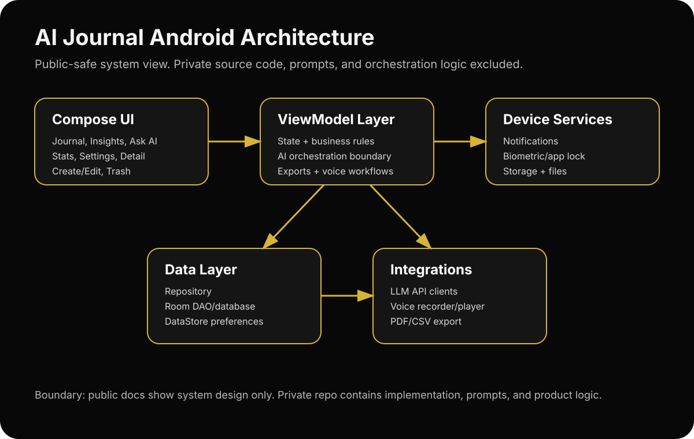
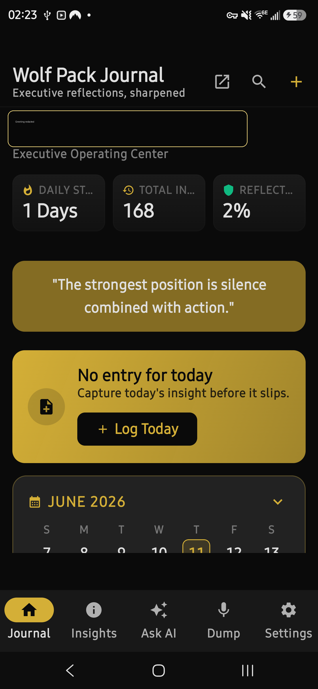
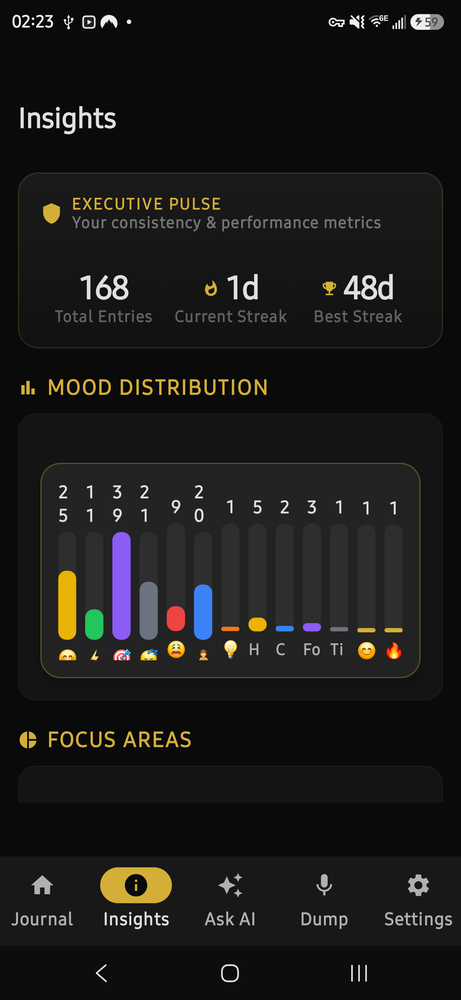
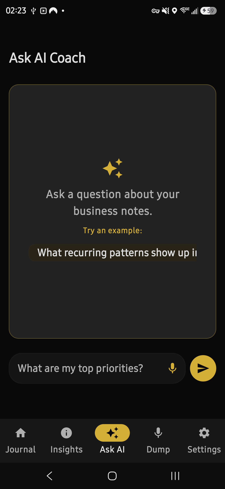
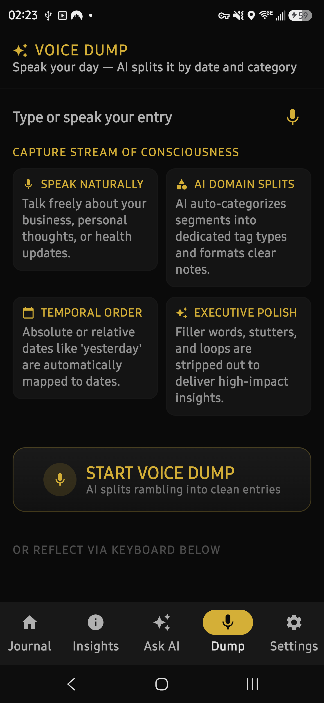
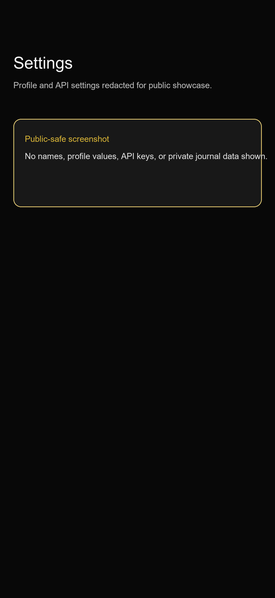
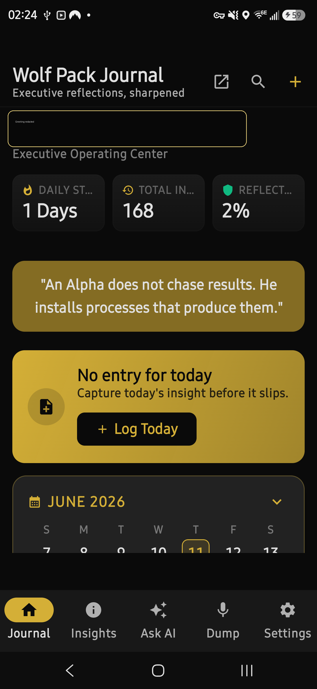

# AI Journal Case Study: Android + LLM Architecture

Public case study for a private Android journaling application built to support executive reflection, AI-assisted insights, voice notes, analytics, reminders, and export workflows.

> Source code is private to protect proprietary AI workflows, prompt strategy, product logic, and monetizable implementation details. This repository shows product thinking, architecture, technical tradeoffs, and recruiter-safe proof of work.

## Demo status

- Screenshots: included
- Architecture notes: included
- Privacy/security notes: included
- Demo video: coming next
- Source code: private, available only through guided screen-share walkthrough for serious technical interviews

## Product summary

The app helps users capture daily business reflections, organize entries, and use AI-assisted review to extract insights from personal journal data.

Core capabilities:

- Create, edit, search, filter, and organize journal entries
- AI-assisted reflection through Ask AI and summary flows
- Voice note recording and transcription support
- Local statistics and consistency tracking
- PDF / CSV export
- Reminder scheduling
- App lock / biometric access flow
- Backup and restore support

## Tech stack

- Kotlin
- Jetpack Compose + Material 3
- Room for local persistence
- DataStore for settings and API key preferences
- WorkManager for reminders and background cleanup
- Retrofit + Gson for LLM API integrations
- Android biometric APIs for app lock flow
- PDF / CSV export utilities

## Architecture snapshot

High-level layers:

1. **Compose UI**: journal, insights, Ask AI, voice dump, settings, entry detail, create/edit flows
2. **ViewModel layer**: app state, business rules, AI orchestration, exports, voice workflows
3. **Data layer**: repository, Room DAO/database, preferences manager
4. **Integration layer**: LLM clients, voice recorder/player, PDF/CSV export, notification workers, security coordinator
5. **Device services**: local storage, biometric prompt, WorkManager, Android notification system

## Current screenshots

Fresh screenshots captured from the current app build. Personal profile values are redacted; no journal content, secrets, or API keys are shown.

| Journal | Insights |
|---|---|
|  |  |

| Ask AI | Voice Dump |
|---|---|
|  |  |

| Settings | Entry capture |
|---|---|
|  |  |

## What this demonstrates

- Building a real Android app beyond toy examples
- Designing a privacy-sensitive local-first product
- Connecting UI, persistence, background jobs, security, exports, and AI workflows
- Handling API key setup without hardcoding secrets into the public repo
- Thinking through recruiter-safe product documentation without leaking source code

## Key engineering decisions

- **Local-first journal data**: journal entries stay on-device by default.
- **Settings via DataStore**: user preferences and API key state live in Android preferences rather than source-controlled config.
- **Room-backed persistence**: journal entries use structured local storage for search, filtering, stats, backup, and restore paths.
- **WorkManager scheduling**: reminders and cleanup jobs use platform-supported background scheduling.
- **Private AI implementation**: prompts, orchestration logic, and model-routing details remain private.

## Repository boundaries

This public repository intentionally excludes:

- app source code
- proprietary AI prompts
- real user journal content
- API keys or credentials
- monetization logic
- private product roadmap

It includes:

- architecture documentation
- privacy/security notes
- product decisions
- public-safe screenshots
- future demo video link
- interview/code-walkthrough policy

## Interview access policy

For serious technical interviews, I can walk through the private implementation over screen share. I do not grant broad public or collaborator access to the private repository because view-only access can still be cloned or copied.

## Planned next additions

- 2-3 minute video demo
- sanitized Kotlin sample showing clean Compose architecture with mock data
- more screenshots using fake demo entries
- short postmortem on navigation/state-management issues solved
